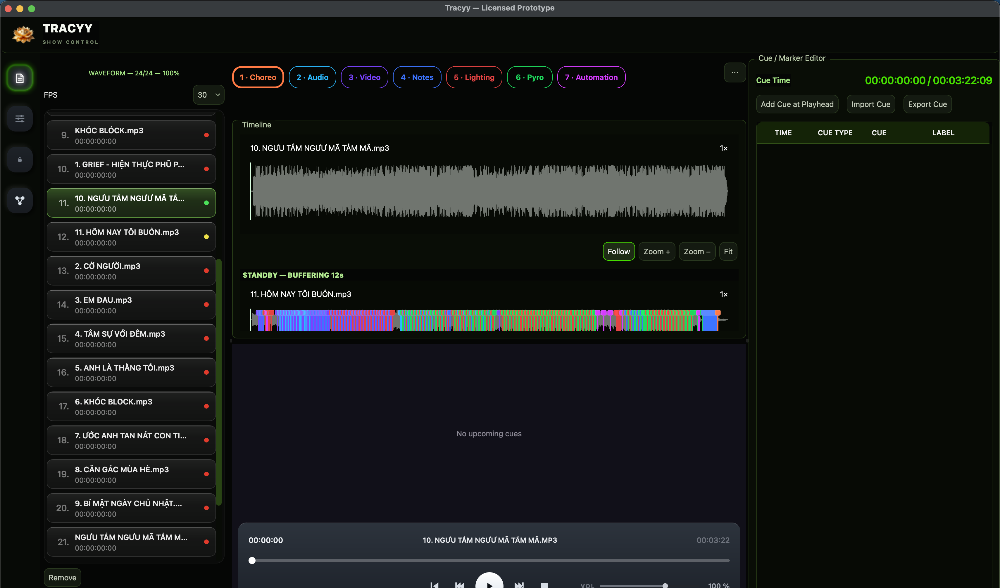
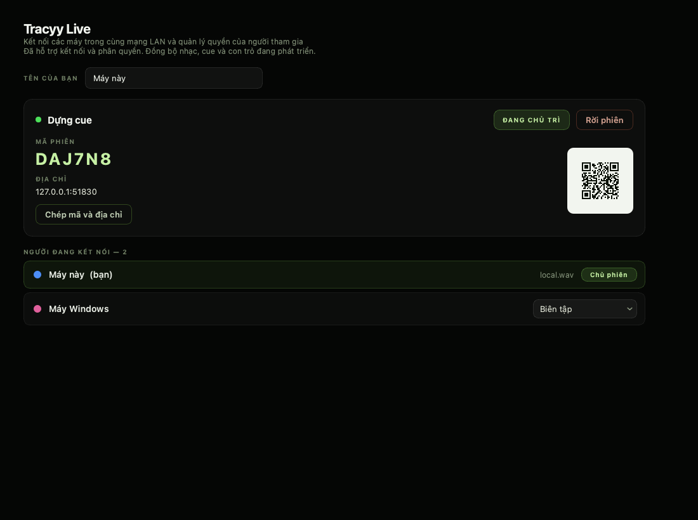

# Tracyy

**Phần mềm phát nhạc cho show sân khấu**: cue sheet theo timecode, phát ra nhiều
card âm thanh cùng lúc, sinh LTC timecode để điều khiển đèn/pyro, và một cue
viewer chạy trên LAN cho người đứng cánh gà xem bằng điện thoại.




## Tính năng

- **Cue sheet** theo timecode cho từng bài; cue chạy theo nhạc hoặc theo LTC nhận từ ngoài
- **Nhiều output cùng lúc** — gán từng card âm thanh cho nhạc hoặc cho LTC, LTC đi đường riêng
- **LTC timecode** chuẩn SMPTE (bản mở rộng tới 99 giờ), sinh ra và đọc vào
- **Waveform** vẽ bằng Qt Quick/Metal, có pyramid LOD và cache envelope trên đĩa
- **Cue viewer trên LAN** — HTTP + SSE, quét QR là xem được trên điện thoại, không cần cài gì
- **Tracyy Live** — nhiều máy vào cùng phiên qua LAN, phân quyền sửa cue, thấy con trỏ của nhau

Ảnh trên: playlist bên trái, timeline với waveform của bài đang phát và bài kế
tiếp đang nạp sẵn, bảng cue bên phải, và các nhóm cue theo màu — Choreo, Audio,
Video, Notes, Lighting, Pyro, Automation.



Tracyy Live: máy chính tạo phiên, máy khác vào bằng mã hoặc quét QR, rồi được
cấp quyền **Biên tập**, **Chỉ sửa cue** hoặc **Chỉ xem**. Mỗi máy vẫn tự phát
nhạc của nó — không có đồng hồ chung.

Định dạng project là `.Tracyy` (JSON).

## Chạy từ source

```bash
python -m pip install -r requirements.txt
```

```bash
python main.py
```

Cần Python 3.11 trở lên.

## Kiến trúc

Tracyy được viết để dùng thật trong show, nên gần như mọi quyết định đều xuất
phát từ một ràng buộc: **audio callback không được trễ một nhịp nào**. Năm chỗ
đáng nói nhất:

**Decoder chạy ở tiến trình riêng, thường trú** — [`audio/streaming.py`](tracyy/audio/streaming.py)
V1 spawn một process mới cho mỗi lần load *và mỗi lần seek*, mỗi process phải
import numpy + soundfile trước khi giải mã được một sample, nên mỗi lần scrub là
hơn 300 ms im lặng. V2 giữ một decoder cho mỗi bài và gửi lệnh vào queue, nên
seek chỉ là một message. Mỗi lệnh mang một `generation` để chunk của vị trí cũ
không lẫn vào vị trí mới.

**Ring buffer lock-free** — [`audio/ringbuffer.py`](tracyy/audio/ringbuffer.py)
Giải quyết *priority inversion*. V1 giữ PCM trong một `deque` khoá bằng `RLock`,
và audio callback phải lấy khoá đó rồi dò chunk bằng Python — ngay trong
PortAudio callback, trong khi feeder thread đang tranh cùng khoá. V2 dùng ring cố
định đánh địa chỉ theo frame tuyệt đối, một producer một consumer, chia nhau đúng
hai số nguyên. Callback không khoá, không cấp phát, nhiều nhất hai `memcpy`.

**LTC sinh bằng numpy** — [`audio/ltc_encoder.py`](tracyy/audio/ltc_encoder.py)
Dạng sóng giống V1 từng bit — show cũ và máy chase cũ phải đọc được. Khác ở chỗ
V1 append từng sample vào list Python (1600 lần append mỗi frame, trong callback),
V2 tính cùng dạng sóng bằng ba phép numpy vào một buffer cấp phát một lần.

**Cue viewer là HTTP + SSE, tiến trình riêng** — [`server/cue_viewer.py`](tracyy/server/cue_viewer.py)
Chạy riêng để một request lỗi không kéo được playback theo. App ghi state xuống
file, server đọc; đường về duy nhất (số thiết bị đang xem) cũng là file — không
mở thêm port, không phải xác thực.

**Một số module không được import Qt** — [`core/__init__.py`](tracyy/core/__init__.py)
Decoder process, pool phân tích waveform và cue viewer đều import một phần của
package. Chỉ cần một dòng re-export tiện tay trong `__init__.py` là Qt vào hết
các process đó, mỗi process thêm vài trăm ms khởi động và vài chục MB RAM — mà
không có gì hỏng ra mặt. Nên các tên cần Qt được resolve lazy qua `__getattr__`,
và [`tests/test_import_boundaries.py`](tests/test_import_boundaries.py) import
từng module trong một interpreter mới rồi soi `sys.modules`.

## Kiểm thử

```bash
python -m pytest
```

307 test, khoảng 89 giây. Phần lớn kiểm tra thứ quan sát được chứ không phải
"gọi hàm rồi assert hàm được gọi": dạng sóng LTC so từng bit với bản tham chiếu
viết lại theo V1, con trỏ presence assert theo pixel đã vẽ, cue viewer chạy HTTP
+ SSE thật qua socket, ranh giới import soi `sys.modules` trong interpreter mới,
và [`test_app_boot.py`](tests/test_app_boot.py) dựng toàn bộ MainWindow offscreen
rồi chạy 2,6 giây để một lần đổi tên trong controller không phải đợi tới lúc
load-in mới lộ.

## Build

```bash
scripts/build_macos.command
```

```bash
scripts\build_windows.bat
```

Cả hai tự tạo virtualenv, cài dependencies, chạy lint + test rồi mới build. Đầu
vào PyInstaller nằm trong [`packaging/`](packaging).

## Khoá licence

Repo này **không chứa** khoá build-time. Lớp licence cần hai khoá — một cho
`license_config.enc`, một để đọc admin USB token — và cả hai được đọc từ biến môi
trường hoặc từ `license_secrets.json` không commit; xem
[`tracyy/licensing/build_secrets.py`](tracyy/licensing/build_secrets.py). Thiếu
khoá thì lớp licence tự báo là chưa cấu hình và quay về trạng thái đã cache, app
vẫn chạy.

## Tài liệu thêm

[docs/REFERENCE.md](docs/REFERENCE.md) — biến môi trường, hướng dẫn dựng phiên
Tracyy Live trên LAN, và cách chẩn đoán khi máy chạy nặng.

## Giấy phép

Proprietary (`LicenseRef-Proprietary` trong [pyproject.toml](pyproject.toml)).
