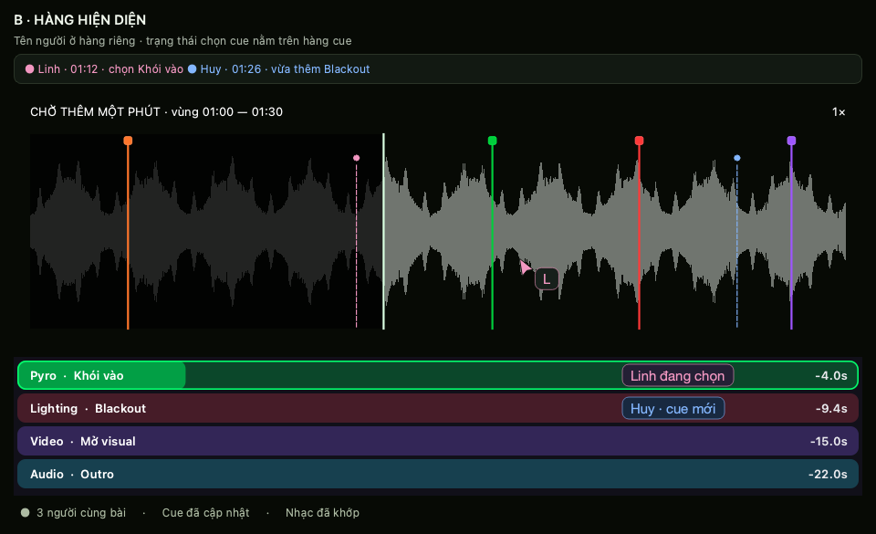
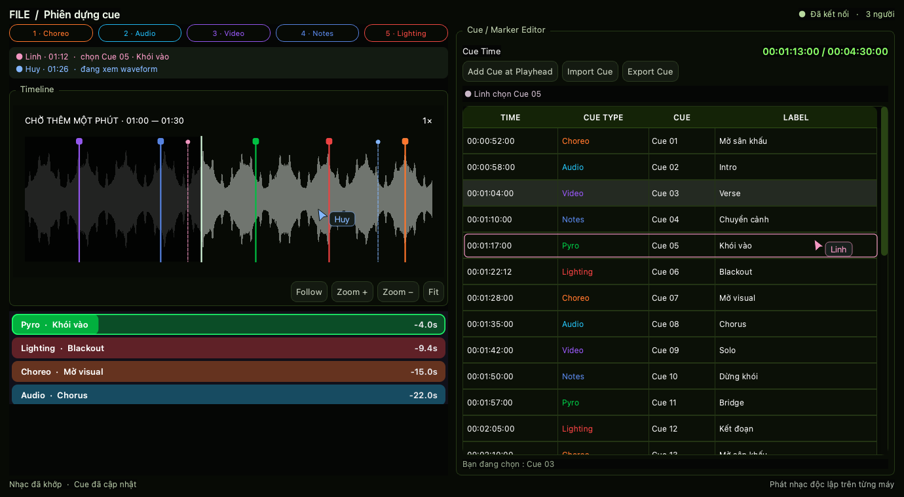
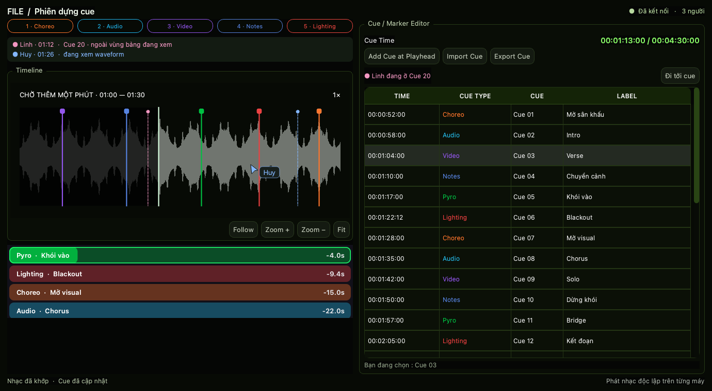

# Tracyy Live — bàn giao phát triển

Cập nhật: 09/09/2026. Đọc tài liệu này trước khi tiếp tục phần cộng tác.

## 1. Điểm dừng hiện tại

**Đã có nền tảng kết nối LAN, danh sách người, phân quyền và khóa sửa cue khi mất liên lạc. Chưa có đồng bộ nội dung cue/nhạc hay con trỏ cộng tác trong app.**

Công việc gần nhất là dựng ảnh thiết kế bằng widget Qt thật với dữ liệu minh họa. Người dùng đã chọn **B — hàng hiện diện phía trên waveform**, đặt trong **File**, rồi yêu cầu mở rộng con trỏ sang bảng **Cue / Marker Editor**. Ba trạng thái bảng cue là đề xuất đang chờ duyệt chi tiết, không phải tính năng chạy được.

- Danh sách công việc: [TASKS_TRACYY_LIVE.md](TASKS_TRACYY_LIVE.md).
- Ảnh và cách dựng lại: [designs/tracyy-live/README.md](designs/tracyy-live/README.md).
- Hướng dẫn chạy/join LAN: [README gốc](../README.md#tracyy-live--sync-qua-mạng-lan).

## 2. Phạm vi người dùng yêu cầu

Đây là cộng tác trong **chuẩn bị và chỉnh sửa**, chưa phải điều khiển chạy show.

- Máy chính vẫn chạy app Tracyy bình thường, đồng thời giữ dữ liệu chuẩn và quản lý quyền.
- Mỗi máy tự mở bài, nghe, pause, seek và sửa bài khác nhau. Playhead người khác chỉ để quan sát, không điều khiển transport của mình.
- **Sync**: tạo/join phiên có tên, người tham gia, quyền, phiên gần đây và dữ liệu tải về.
- **File**: playlist, waveform, loading cue, bảng cue và lớp hiện diện cộng tác.
- Máy mới cần tải nhạc từ máy chính về bản cục bộ để nghe và sửa; đường dẫn Mac không thể dùng trực tiếp trên Windows.
- Thêm/thay nhạc phải theo quyền và luồng phê duyệt của máy chính. Bản chưa duyệt không thay dữ liệu chuẩn.
- Mất liên lạc: báo đỏ, khóa sửa dữ liệu phiên chung. Làm offline phải tạo **bản nháp riêng**, kết nối lại gửi **đề xuất** để máy chính quyết định merge.
- Không mở rộng sang LTC chase, đồng bộ playback bắt buộc, trigger MA hay VPS trong đợt này.

## 3. Hiện trạng đã đối chiếu với source

| Hạng mục | Trạng thái / giới hạn |
|---|---|
| B0: ID bài/cue, project v3 → v4 | Có mã nguồn và test; ID chuỗi, không ép `int(cue_id)` |
| Host/client LAN | HTTP JSON, protocol **2**, cổng mặc định **8090**; cần cùng bản app ở hai đầu |
| Tên phiên, roster, role | Có; người mới là viewer, máy chính cấp quyền |
| Reconnect, phản hồi cũ | Có worker nền, xử lý lỗi và loại phản hồi từ lần kết nối cũ |
| Giữ quyền sau mất mạng | Trong cùng phiên host và vòng đời credentials của client; không hứa giữ qua restart app/host |
| Báo mất kết nối + guard sửa cue | Có khi phát hiện mất liên lạc; không phát hiện tức thì lúc rút mạng |
| Phiên gần đây, mở/xóa cache | Có UI và cấu trúc store; không đồng nghĩa nhạc đã được truyền qua mạng |
| Presence hiện tại | Có tên, `track_path`, `position_seconds` trong roster; chưa có overlay con trỏ/playhead ở File |
| Cue ops, journal, dedup, revision (T1) | **Có từ 09/09/2026**: `tracyy/sync/document.py` + endpoint `/live/submit_op`; server kiểm quyền/validate, journal NDJSON fsync, dedup `op_id`, stale theo cue; heartbeat mang `ops` cho peer tụt hậu. UI **chưa** nối — client chưa apply op |
| Snapshot tài liệu, hash | Chưa có; `LiveServer.snapshot()` vẫn là **roster**, `document.json` để dành cho snapshot compact (phase B) |
| Truyền nhạc, phê duyệt thay nhạc | Chưa có |
| Offline proposal / merge | Chưa có |
| Mac ↔ Windows vật lý | Chưa xác nhận; test loopback/tiến trình riêng không thay thế kiểm thử hai máy thật |

Role hiện tại trong `tracyy/sync/model.py`:

| Role | Sửa cue | Sửa playlist | Thay media | Quản lý người |
|---|---|---|---|---|
| Owner | Có | Có | Có | Có |
| Editor | Có | Có | Không | Không |
| Cue only | Có | Không | Không | Không |
| Viewer | Không | Không | Không | Không |

Đây là capability model hiện tại, **không phải bằng chứng mọi luồng media đã được bảo vệ**. Khi bổ sung API cần kiểm tra quyền ở server cho từng thao tác; khóa UI không đủ. Quyền gửi đề xuất thêm/thay media cần thiết kế rõ, không tự cho editor quyền ghi đè file chuẩn.

## 4. Thiết kế giao diện đã chọn

Giữ waveform, cue marker, bảng cue và phong cách tối/glass hiện tại. Không thay waveform bằng cột minh họa lớn, không đẩy transport lên đầu. Ảnh dưới là vùng làm việc minh họa, không phải toàn bộ MainWindow.

### B — hàng hiện diện trên waveform



Hàng riêng hiển thị tên, màu, bài/vị trí và hoạt động. Playhead người khác mảnh, dễ phân biệt với playhead cục bộ. Con trỏ nhỏ có tên; không che waveform và marker.

### Con trỏ đi vào bảng cue



Linh chọn Cue 05: viền hồng mảnh và con trỏ trong bảng. Huy ở waveform. Lựa chọn cục bộ Cue 03 vẫn giữ nguyên; màu cue type không bị màu người dùng thay thế.

### Chỉ rõ ô đang sửa


Huy sửa LABEL của Cue 06: viền xanh ở đúng ô và trạng thái phía trên bảng. Không dựng popup che chữ ở dòng kế tiếp. Viền hiện diện **không tự có nghĩa là khóa ô**; cơ chế xung đột cần server xử lý riêng.

### Hai máy cuộn khác nhau



Linh ở Cue 20 ngoài vùng nhìn: hiện thông báo và nút **Đi tới cue**. Không vẽ con trỏ vào dòng sai và không tự cuộn bảng của người đang làm việc. Bài khác nhau thì báo tên bài ở hàng hiện diện, không vẽ cursor lên bài đang mở.

Hành vi animation đề xuất: cue mới xuất hiện khoảng 200 ms, viền màu người tạo và tên khoảng 2 giây; cue vừa dời trượt ngắn tới vị trí mới. Đây là hiệu ứng trình bày sau thao tác được chấp nhận, không thay đổi timecode lưu trong model. Có tùy chọn giảm chuyển động; không replay hiệu ứng hàng loạt khi tải snapshot.

## 5. Thứ tự lập trình đề xuất

### A. Dữ liệu chuẩn và transport cập nhật

Mục tiêu đầu tiên: **client A thêm cue → server chấp nhận → host và client B thấy cùng một cue đúng một lần**, không đổi bài/playhead của B.

- Dùng `session_id`, `document_id`, `track_id`, `cue_id` ổn định; file path chỉ là ánh xạ cục bộ. Hiện presence còn dùng `track_path`, phải chuyển sang `track_id` khi triển khai.
- Tách service tài liệu khỏi HTTP handler và Qt UI. Máy chính cũng đi qua cùng pipeline thao tác như client để không có hai cách ghi dữ liệu.
- Envelope đề xuất: `op_id`, `session_id`, `document_id`, `base_revision`, `track_id`, `cue_id`, `kind`, `payload`. Server lấy tác giả từ credentials đã xác thực, không tin `actor_id` do client tự khai.
- Server kiểm tra quyền/schema/ràng buộc → ghi journal bền vững → tăng revision → trả ACK và phát operation đã commit.
- Chống thao tác trùng bằng `op_id`; ACK bị mất rồi gửi lại không tạo thêm cue. Client chỉ áp dụng mỗi revision một lần.
- Tách sự kiện bền vững (cue/playlist) khỏi presence tạm thời. Heartbeat hiện 1,5 giây không đủ cho cursor mượt; bổ sung kênh push/stream hoặc transport phù hợp sau khi chốt giao thức.
- Không hứa LAN luôn 5 ms. Đo end-to-end. Phương án ban đầu chờ ACK trước khi commit cue lên UI; trong lúc chờ hiển thị pending không gây cảm giác nút không hoạt động.
- Kéo cue có thể có preview riêng tạm thời; chưa biến thành cue chuẩn trước ACK. Presence drag và operation commit là hai loại dữ liệu khác nhau.

### B. Reconnect, snapshot và chống lệch

- Nhớ `last_applied_revision`; reconnect yêu cầu phần journal thiếu. Nếu journal đã hết retention hoặc session đổi thì lấy snapshot tài liệu mới.
- Snapshot chứa revision và manifest. Hash tính trên biểu diễn canonical có cùng quy tắc thứ tự/số/schema, không bao gồm local file path hay presence.
- Phát hiện gap/hash lệch: vào trạng thái **đang đồng bộ lại**, giữ khóa sửa bản chung; tải/kiểm tra/apply snapshot nguyên tử rồi mới mở khóa. Kết nối HTTP phục hồi chưa đủ để mở quyền sửa.
- Thao tác stale trên cùng cue/field phải báo conflict; không âm thầm ghi đè. Có thể cho các thao tác độc lập trên bài/cue khác đi tiếp sau khi kiểm tra revision thích hợp.
- Role bị thu hồi trong khi request chờ: server kiểm tra quyền tại commit và từ chối; UI bỏ pending, giữ dữ liệu chuẩn.
- Undo trong phiên là operation đảo có kiểm tra revision, không khôi phục toàn bộ snapshot cũ đè công việc người khác.

### C. Nhạc và lưu trữ

- Host phát manifest: `track_id`, tên, `media_hash`, dung lượng, phiên bản. Không dùng tên file làm danh tính; hai file cùng tên có thể khác nội dung.
- Client tải có tiến độ vào file tạm `.part`, có resume; xác minh hash/dung lượng rồi mới rename nguyên tử thành file dùng được. Thiếu file thì hiện đang tải, không báo đã đồng bộ nhạc.
- Giới hạn kích thước, xác thực download/upload, chống path traversal; không cung cấp API đọc tùy ý đường dẫn máy chính.
- Ánh xạ `track_id → local_path`; mỗi máy nghe độc lập từ file đã có. Tải/giải mã/hash chạy ngoài UI/audio callback.
- `ShowStore` hiện có `<cache_root>/live/<show_id>/media`, `peaks`, `document.json`. Đây là **khung cache**, chưa là pipeline download.
- Cache nhạc tải lại được khác với nháp offline/upload chưa duyệt. Nháp là dữ liệu người dùng, phải ở vùng lưu bền vững riêng; không đặt chung vùng bị nút **Xóa dữ liệu cache** xóa mất.
- Chính sách xóa nhạc khi rời phiên hay giữ để nối lại từng được thảo luận theo nhiều option, chưa có cơ chế tự xóa được chốt. Giữ hành vi xóa thủ công hiện tại; không tự xóa bản gốc của host.
- Trước khi triển khai cache mạng, kiểm tra `show_id` do host cấp ổn định xuyên reconnect, không chỉ suy ra từ tên hiển thị/IP.
- Bản nhạc mới/thay thế được stage và xin duyệt. Chủ phiên chấp nhận thì cập nhật manifest/version rồi phân phối; từ chối không ảnh hưởng bản hiện hành. Khi thay nhạc, cần quyết định rõ giữ/review/đổi vị trí cue, không âm thầm retime.

### D. Presence trong File

- Payload đề xuất: `track_id`, `surface` (waveform/cue_table/none), `cue_id`, `column_key`, `position_seconds`, `playing`, `selection`, `activity`, `sequence` và điểm tương đối trong vùng logic nếu cần.
- Waveform neo theo thời gian bài; bảng neo theo `cue_id + column_key`, không theo row index hay pixel màn hình. Máy nhận tìm geometry qua viewport hiện tại.
- Coalesce/rate-limit presence; bỏ gói sequence cũ, có TTL. Cursor rời vùng, đổi bài hay disconnect phải biến mất, không giữ thành “người ma”.
- Nội suy playhead để nhìn mượt, giới hạn extrapolation; không gọi seek/play cục bộ theo người khác. Tần suất phát và ngân sách render phải đo, không tăng heartbeat toàn hệ thống một cách mù quáng.
- Overlay không nhận chuột/bàn phím, không đổi focus, không che editor hay tooltip, không đổi local selection, không tự scroll. Không rebuild toàn bảng ở mỗi presence tick.

### E. Đề xuất offline

- Khi disconnected giữ bản chung read-only. Người dùng chủ động tạo nháp độc lập có `proposal_id`, `base_revision`, bản gốc tham chiếu và danh sách thay đổi; không ghi thẳng vào phiên.
- Khi nối lại, gửi proposal; host xem thêm/sửa/xóa và conflict trước khi chấp nhận/từ chối. Chỉ phần được chấp nhận mới thành operations chuẩn.
- Trường hợp sửa/sửa, sửa/xóa, track/media đã đổi phải có kết quả tường minh. Giữ nháp cho tới khi nhận quyết định xác nhận, không mất vì reconnect hay dọn cache.

Các trường và pipeline ở mục 5 là **đề xuất để triển khai tiếp**, chưa phải API có sẵn. Chốt schema và test trước khi đổi wire protocol; tăng version khi không tương thích.

## 6. Bản đồ mã nguồn

| File | Vai trò / điểm cần đọc |
|---|---|
| `tracyy/core/ids.py` | `cue_key`, `track_key`, cấp ID; không quay lại `max(id)+1` |
| `tracyy/controllers/project.py` | Lưu version 4, migrate v3, ánh xạ track ID/path |
| `tracyy/sync/protocol.py` | Wire version, URL, timeout, endpoint join/heartbeat/leave |
| `tracyy/sync/server.py` | Host HTTP, credentials, quyền và roster; không có document ops |
| `tracyy/sync/client.py` | Worker nền, bypass proxy, reconnect, loại phản hồi cũ |
| `tracyy/sync/model.py` | Role/capability, peer model |
| `tracyy/sync/session.py` | Qt session state, roster, capability guards |
| `tracyy/sync/store.py` | Thư mục cache theo phiên, tính dung lượng và xóa có giới hạn |
| `tracyy/controllers/sync.py` | Trang Sync, recent sessions, tick mạng, `require_cue_edit_rights` |
| `tracyy/controllers/cue.py` | Các đường sửa cue, bảng, undo và cue type; cần routing operations |
| `tracyy/ui/main_window.py` | Layout File, bảng, waveform, scheduler, transport overlay |
| `tracyy/widgets/waveform.py` | Widget waveform thật, marker geometry, `Signal(str, float)` khi dời marker |
| `tracyy/widgets/cue_widgets.py` | `CueTableDelegate`; giữ rendering hiện tại |
| `tracyy/widgets/cue_loading.py` | Loading cue ảo hóa; tránh rebuild liên tục |
| `tracyy/server/cue_viewer.py` | Web viewer chỉ đọc riêng; không nhầm với Tracyy Live editing |

Lưu ý: docstring một số module mô tả kiến trúc dự kiến xa hơn code hiện có. Kiểm tra implementation và tests, không suy từ tên `snapshot`/`store` rằng content sync đã xong.

## 7. Kiểm thử và giới hạn xác minh

Chạy từ root dự án, Python 3.11+ với dependencies đã cài:

```bash
python3 -m pytest tests/test_sync_ui.py tests/test_sync_reliability.py tests/test_sync_network.py tests/test_sync_session.py tests/test_sync_store.py tests/test_import_boundaries.py -o addopts= --tb=short
python3 -m pytest tests/test_project_ids.py -o addopts= --tb=short
python3 docs/designs/tracyy-live/file_cue_presence_preview.py
```

Kiểm lại khi bàn giao 09/09/2026: hai nhóm trên chạy chung đạt **121 passed in 44.15s**, exit code 0 (Sync + import boundaries 106 test, project IDs 15 test). Chi tiết môi trường ghi trong TASKS. Không suy ra toàn bộ suite/app production đã đạt từ nhóm test này.

`test_sync_ui.py` dùng Qt shell tối thiểu, settings riêng; không chứng minh full MainWindow hay license/audio đều ổn. `test_project_ids.py` có mở MainWindow và test migration; cần chú ý modal, thiết bị audio và mount mạng khi chạy.

Khi triển khai tiếp, cần test mất ACK, trùng/lệch thứ tự operation, gap revision, hash sai, host restart, thu hồi quyền giữa chừng, download gián đoạn, file cùng tên khác hash, hai bài khác nhau, scroll/sort khác nhau, DPI Mac/Win, và nháp offline không bị mất.

Kiểm tra vật lý cuối: hai máy macOS/Windows, cùng LAN, cả hai chiều làm host, thêm/sửa/xóa cue, tải file, rút mạng, nối lại, thu hồi role. HTTP hiện dùng cho LAN tin cậy; chưa có TLS để mở thẳng ra Internet.

## 8. Chỉ dẫn cho người/agent tiếp nhận

1. Đọc tài liệu này và task list; kiểm source hiện tại vì có thể người dùng đã sửa thêm.
2. Không coi ảnh preview là code cộng tác đã chạy. Không tái thiết kế toàn app; giữ phương án B và widget native.
3. Bắt đầu T1/T2 bằng test một cue đi qua host và hai client; sau đó triển khai UI/presence theo pipeline chung.
4. Giữ các fix mạng đã có: proxy bypass, credentials không lộ trong roster, quyền host, worker cũ không cập nhật phiên mới, không chặn UI khi reconnect.
5. Không đưa network/disk/hash vào audio callback. Tôn trọng import boundary không Qt của các module backend hiện có; session/controller là lớp Qt.
6. Không đụng license, audio transport, volume, MA hay mount mạng ngoài phạm vi. Không xóa cache/nháp thật chỉ để test.
7. Bàn giao từng lát cắt với test và ảnh thật; ghi rõ phần chỉ test tự động và phần đã thử hai máy vật lý.

Prompt ngắn để tiếp tục:

> Đọc `docs/README_TRACYY_LIVE_HANDOFF.md` và `docs/TASKS_TRACYY_LIVE.md`. Tiếp tục Tracyy Live cho chuẩn bị/chỉnh sửa, không điều khiển chạy show. Giữ phương án B ở File và mở presence sang bảng cue. Bắt đầu từ document operations có server authority, ACK/dedup/revision và kiểm thử host + hai client; không coi roster snapshot là document snapshot. Bảo toàn tính năng hiện có và cập nhật task list theo kết quả thực tế.
